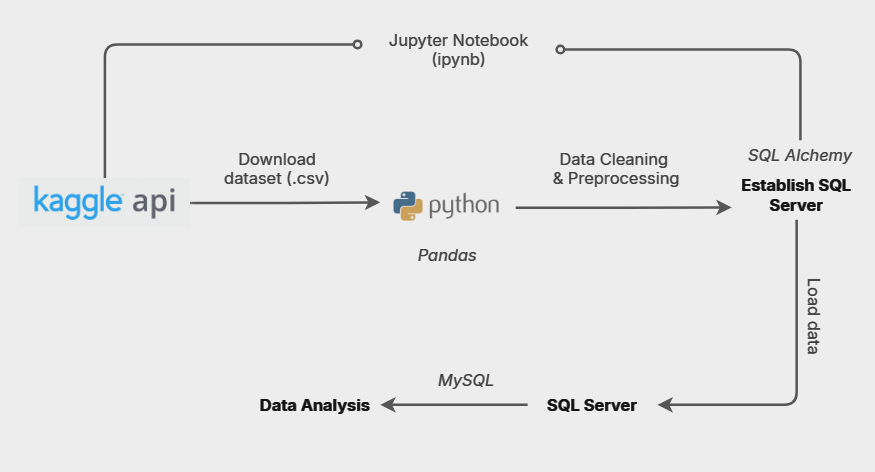

> I’ve prepared a detailed analysis with comments in a PDF. You can view it here.
> [SQL Bank Target Marketing Detailed Analysis - PDF](./SQL%20Bank%20Target%20Marketing%20Analysis.pdf)
# SQL Bank Target Marketing Analysis
## Overview
This project involves a comprehensive analysis of marketing campaigns held by a bank aimed at increasing the number of term deposit subscribers. The goal is to identify the key factors influencing customer decisions, including their financial behaviors and demographic insights. The analysis provides a detailed account of the project’s objectives, business problems, findings, and conclusions.



## Objectives 
1. Evaluate the outcomes of a bank’s marketing campaign to acquire term deposit customers.
2. Identify key factors influencing customers' decisions to subscribe to deposits.
3. Provide recommendations to improve future targeted campaigns based on the analysis.
## Dataset
The dataset for this project is sourced from the Kaggle dataset:
- [Bank Target Marketing Dataset](https://www.kaggle.com/datasets/seanangelonathanael/bank-target-marketing)

## Tech Stack
- **Kaggle API:** To download the dataset.
- **Jupyter Notebook:** IDE for data exploration.
- **Python (Pandas):** For initial data cleaning and manipulation
- **SQLAlchemy:** To establish connection with the local SQL database server.
- **SQL Server:** For detailed query analysis.

## Python Data Gathering
### Importing Libraries
```py
import os
import pandas as pd
import numpy as np
```
### Data Collection & Extraction
```py
# download dataset using kaggle api
# !pip install kaggle
import kaggle
!kaggle datasets download seanangelonathanael/bank-target-marketing -f "Bank Target Marketing Dataset.csv"
# The csv is packed into a zipped file.

# Extract data from zip file
import zipfile
zip_ = zipfile.ZipFile('data.csv.zip')
zip_.extractall()
zip_.close()
```

### Data Cleaning
```py
# read data
df = pd.read_csv('data.csv')
df.head()
df.info()
```

#### Check for duplicate values
```py
df.duplicated().sum()   # 11162

# remove duplicates
print(f'Size of the dataset initially: {df.shape}')

df.drop_duplicates(inplace=True)
```

#### Check for null values
```py
df.isna().sum()   # 0
```
#### Rename columns for easy analysis
```py
# rename df columns:

new_cols = {
'default': 'credit_default', 
'contact': 'contact_type', 
'day': 'contact_day', 
'month': 'contact_month', 
'campaign': 'contact_count'
}

df = df.rename(columns=new_cols)
```

### Establish a SQL Connection
#### Load data in SQL server
```py
# !pip install pymysql
# !pip install mysqlclient

import sqlalchemy as sal
from sqlalchemy import create_engine

hostname = 'localhost'
username = '****'
password = '****'
port = 3306
database = 'my_sql'

engine = create_engine('mysql+pymysql://' + username + ':' + password + '@' + hostname + ':' + str(port) + '/' + database)
conn=engine.connect()
```

#### Connect the dataset to SQL server
```py
df.to_sql('bank_df', method=None, schema='my_sql', con=conn, index=False, if_exists='append')

conn.commit()
```

## SQL Data Analysis
### Data Overview
- **Total records:** 45,211
- **Features:**
  - **Numerical:** (8 features)  
  *id, age, balance, contact_day, duration, contact_count, pdays, previous*
  - **Categorical:** (10 features)  
  *job, marital, education, credit_default, housing, loan, contact_type, contact_month, poutcome, deposit*
- **Target variable:** deposit (yes/no)
- **Null Values:** No missing values across all columns.

### Schema
```sql
DROP TABLE IF EXISTS bank_df;

CREATE TABLE bank_df (
	age INT, 
	job VARCHAR(20), 
	marital VARCHAR(20), 
	education VARCHAR(20), 
	credit_default VARCHAR(10), 
	balance FLOAT, 
	housing VARCHAR(10),
  loan VARCHAR(10), 
  contact_type VARCHAR(20), 
  contact_day INT, 
  contact_month VARCHAR(10), 
  duration INT, 
  contact_count INT,
  pdays INT,
  previous INT, 
  poutcome VARCHAR(20), 
  deposit VARCHAR(10)
);

```
### Descriptive Statistics
#### 1. What is the age distribution of customers?
```sql
SELECT MIN(age), MAX(age), AVG(age) 
FROM bank_df;
```
#### 2. What is the average yearly balance of customers in the dataset?
```sql
SELECT MIN(balance), MAX(balance), AVG(balance) 
FROM bank_df;
```

#### 3. What impact does the frequency of prior contact (pdays) have on customer engagement in the campaign?
```sql
SELECT pdays, COUNT(*) count
FROM bank_df
GROUP BY pdays
ORDER BY count DESC;
```

### Categorical Data Analysis
#### 1. Job Distribution:  
```sql
SELECT job, COUNT(*) count
FROM bank_df
GROUP BY job
ORDER BY count DESC;
```

#### 2. Marital Status:  
```sql
SELECT marital, 
       COUNT(*) AS count, 
       ROUND((COUNT(*) / (SELECT COUNT(*) FROM bank_df)) * 100, 2) AS percentage
FROM bank_df
GROUP BY marital
ORDER BY count DESC;
```
#### 3. Education:  
```sql
SELECT education, COUNT(*) count
FROM bank_df
GROUP BY education
ORDER BY count DESC;
```
#### 4. Communication:  
```sql
SELECT contact_type, COUNT(*) count
FROM bank_df
GROUP BY contact_type 
ORDER BY count DESC;
```

#### 5. Monthly Trends: 
```sql
SELECT contact_month, COUNT(*) count
FROM bank_df
GROUP BY contact_month 
ORDER BY count DESC;
```

### Data Transformation
#### 1. Adding a Primary Key column
```sql
ALTER TABLE bank_df
ADD client_id INT NOT NULL AUTO_INCREMENT PRIMARY KEY;
```

#### 2. Combining columns
```sql
ALTER TABLE bank_df
ADD loan_type VARCHAR(20);

UPDATE bank_df
SET loan_type = 
  CASE 
    WHEN housing = 'yes' THEN 'housing-loan' 
    WHEN loan = 'yes' THEN 'personal-loan' 
    ELSE 'no loan' 
  END;
```

The 'housing' and 'loan' columns can be dropped now.

#### 3. Splitting columns

##### CATEGORY BY AGE

```sql
ALTER TABLE bank_df
ADD age_group VARCHAR(20);

UPDATE bank_df
SET age_group =
	CASE 
    WHEN age >= 18 AND age <= 25 THEN 'Young Adult'
    WHEN age > 25 AND age <= 34 THEN 'Early Career'
    WHEN age > 34 AND age <= 54 THEN 'Mid Career'
    WHEN age > 54 AND age <= 64 THEN 'Pre-Retirement'
    WHEN age > 64 THEN 'Retirement'
  END;
```

##### CATEGORY BY QUARTER
```sql
ALTER TABLE bank_df
ADD quarter VARCHAR(20);

UPDATE bank_df
SET quarter =
  CASE 
    WHEN contact_month IN ('jan', 'feb', 'mar') THEN 'Q1'
    WHEN contact_month IN ('apr', 'may', 'jun') THEN 'Q2'
    WHEN contact_month IN ('jul', 'aug', 'sep') THEN 'Q3'
    WHEN contact_month IN ('oct', 'nov', 'dec') THEN 'Q4'
  END;
```
We are now ready for exploratory data analysis.

## Exploratory Data Analysis
- **Key Variables to Investigate:**
  - **credit_default**: Whether the customer has credit in default. (yes/no)
  - **poutcome**: Result of the previous marketing campaign. (success/failure)
  - **deposit**: Whether the customer subscribed to a term deposit. (yes/no)
- **Distribution of Variables:**
  - Customer demographics (age, income level)
  - Product features (interest rate, deposit term)
  - Campaign channel (email, phone call, social media)

#### 1. How many customers subscribed to a term deposit after the campaign? 
```sql
SELECT deposit, COUNT(*) AS total_subscribed 
FROM bank_df
GROUP BY deposit
```

#### 2. What percentage of customers subscribed to a term deposit after the marketing campaign?
```sql
SELECT COUNT(*) AS total_subscribed, 
       (COUNT(*) / (SELECT COUNT(*) FROM bank_df)) * 100 AS percent_subscribed
FROM bank_df
WHERE deposit = 'yes';
```

##### Subscribers with a balance above 0:
```sql
SELECT 
  SUM(CASE WHEN balance > 0 THEN 1 ELSE 0 END) AS positive_bal,
  SUM(CASE WHEN balance <= 0 THEN 1 ELSE 0 END) AS negative_bal 
FROM bank_df;
```


#### 3. What is the distribution of customers who subscribed to the term deposit based on their balance?
```sql
SELECT
  SUM(CASE WHEN deposit = 'yes' AND balance > 0 THEN 1 ELSE 0 END) AS positive_subscribed,
  SUM(CASE WHEN deposit = 'no' AND balance > 0 THEN 1 ELSE 0 END) AS positive_not_subscribed,
  SUM(CASE WHEN deposit = 'yes' AND balance <= 0 THEN 1 ELSE 0 END) AS negative_subscribed,
  SUM(CASE WHEN deposit = 'no' AND balance <= 0 THEN 1 ELSE 0 END) AS negative_not_subscribed
FROM bank_df;
```

##### Banks targeting customers with low balance: 
```sql
SELECT 
  COUNT(contact_count) AS times_called, 
  balance
FROM bank_df
WHERE deposit = 'yes'
GROUP BY balance
ORDER BY times_called DESC;
```

#### 4. What are the demographic statistics of customers who subscribed to the term deposit despite having a negative balance?
##### Job Demographics:
```sql
SELECT job, COUNT(*) AS count
FROM bank_df
WHERE balance <= 0
  AND deposit = 'yes'
GROUP BY job
ORDER BY count DESC;
```
##### Age Demographics:
```sql
SELECT age_group, COUNT(*) count 
FROM bank_df
WHERE balance <= 0
AND deposit = 'yes'
GROUP BY age_group
ORDER BY count DESC;
```

#### 5. Is there any impact of loan status on the subscription rates for term deposits?
```sql
SELECT 
  loan_type, 
  COUNT(*) AS count, 
  ROUND(COUNT(*) / 
    (SELECT COUNT(*) 
    FROM bank_df 
    WHERE deposit = 'yes' 
      AND balance > 0) * 100, 2) AS percent_subscribed
FROM bank_df
WHERE balance > 0
  AND deposit = 'yes'
GROUP BY loan_type
ORDER BY count;
```

#### 6. Are there any seasonal trends for customer subscriptions?
##### *Is there a correlation between the frequency of customer contacts and their subscription rate?*
```sql
WITH cte AS (
  SELECT
    contact_month,
    COUNT(*) AS contact_count,
    SUM(CASE WHEN deposit = 'yes' THEN 1 ELSE 0 END) AS subscribed,
    SUM(CASE WHEN deposit = 'no' THEN 1 ELSE 0 END) AS not_subscribed
  FROM bank_df
  GROUP BY contact_month
)
SELECT
  contact_month,
  contact_count,
  subscribed,
  not_subscribed,
  subscribed / contact_count call_to_subscriber_ratio
FROM cte
ORDER BY call_to_subscriber_ratio DESC;
```


#### 7. Are there significant variations in the subscription ratio among customers?
```sql
WITH cte AS (
  SELECT
    job,
    SUM(CASE WHEN deposit = 'yes' THEN 1 ELSE 0 END) AS subscribed,
    SUM(CASE WHEN deposit = 'no' THEN 1 ELSE 0 END) AS not_subscribed
  FROM bank_df
  GROUP BY job
)
SELECT
  job,
  subscribed,
  not_subscribed,
  (subscribed / not_subscribed)*100 AS ratio
FROM cte
ORDER BY ratio DESC;
```

##### Are these preferred customers (students and retirees) reliable choices for term deposits?
```sql
SELECT job, credit_default, COUNT(*) AS count
FROM bank_df
WHERE deposit = 'yes'
  AND job IN ('student', 'retired')
GROUP BY job, credit_default
ORDER BY job, count DESC;
```

#### 8. Are there any returning subscribers from previous campaigns?

##### *Is there any relationship between the average yearly balance and the loan status of subscribers?*
```sql
SELECT 
  loan_type, 
  MIN(balance), 
  MAX(balance)
FROM bank_df
WHERE deposit='yes'
GROUP BY loan_type
ORDER BY MAX(balance) DESC
```

#### 9. How do past customer interactions affect the campaign outcomes?
```sql
WITH cte AS (
  SELECT DISTINCT poutcome, pdays
  FROM bank_df
)
SELECT 
  poutcome, 
  AVG(pdays) AS avg_pdays
FROM cte
GROUP BY poutcome
ORDER BY AVG(pdays) DESC;
```
Older customers are less likely to subscribe to the term deposits.

#### 10. What are the conversion rates across different customer segments by age group and quarter?

```sql
SELECT 
    quarter, 
    age_group,
    ROUND(AVG(CASE WHEN deposit = 'yes' THEN 1 ELSE 0 END) * 100, 2) AS success_conversion_rate,
    ROUND(AVG(CASE WHEN deposit = 'yes' AND pdays = -1 THEN 1 ELSE 0 END) * 100, 2) AS new_customer_conversion_rate,
    ROUND(AVG(CASE WHEN deposit = 'yes' AND poutcome LIKE '%failure%' THEN 1 ELSE 0 END) * 100, 2) AS potential_customer_conversion_rate
FROM bank_df
GROUP BY age_group, quarter
ORDER BY success_conversion_rate DESC;
```


## Conclusion & Key Insights
- **Q1 had the highest conversion rate** (55.5%) for young adults (18-25), making it the most effective time to target this age group.
- **Q2 had the lowest conversion rate** (7%) for mid-career individuals (35-55), which suggests room for improvement in strategies targeting this demographic.
- Campaigns in **March, September, October, and December** were the most successful, with high conversion rates despite lower interactions. Banks should increase their outreach during these months for high turnover rates.
- Customers in **management and blue-collar jobs**, even with negative bank balances, should be targeted for future campaigns.

## Recommendations
- Prioritize follow-ups with older customers and those interested in past campaigns for higher subscription rates.
- Focus on engaging with customers with positive balances and no active loans, as well as those in management and blue-collar jobs.
- Increase outreach efforts in March, September, October, and December for better results.
- Target young adults (18-25) during Q1 for higher conversion rates
- Improve existing strategies for mid-career individuals (35-55) to boost their engagement in Q2.
